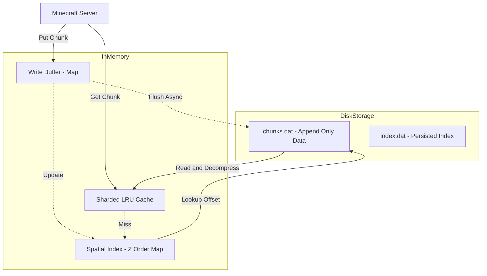

# BlazeDB

BlazeDB is a high-performance, specialized storage engine for Minecraft Bedrock Edition worlds, designed essentially as a drop-in replacement for LevelDB.

It is engineered to overcome specific bottlenecks found in general-purpose KV stores like LevelDB when applied to Minecraft's spatial data patterns. BlazeDB leverages **Z-Order (Morton) Curves** for spatial locality, an **append-only architecture** for high write throughput, and a **sharded O(1) LRU cache** for low-latency reads.

## Features

- 🚀 **High Performance**: Optimized specifically for chunk data (reads/writes).
- 🗺️ **Spatial Locality**: Uses Z-Order (Morton) curves to keep creating/loading nearby chunks physically close on disk, effectively acting as a hardware-level prefetch.
- 💾 **Append-Only Storage**: Writes are always appended to the end of the file, eliminating random write seeks and "compaction stalls" during gameplay.
- 🧠 **Smart Caching**: Sharded, thread-safe LRU cache with O(1) operations and auto-tuning capabilities.
- ⚡ **Async Writes**: Non-blocking background write worker with buffering to prevent frame drops during heavy chunk generation.
- 📦 **Compression**: Supports LZ4 (default, ultra-fast) and Snappy. Includes buffer pooling to minimize GC pressure.
- 🛡️ **Crash Safety**: Atomic offset tracking and index rebuilding capabilities.

## Architecture & How It Works

### Data Storage Schematic

BlazeDB avoids the complexity of LSM Trees (used by LevelDB) in favor of a simpler, faster append-only model paired with an in-memory spatial index.



### 1. Z-Order Spatial Indexing
Minecraft accesses data spatially (e.g., "load all chunks around player X,Z"). Standard KV stores like LevelDB just see keys as strings and may scatter nearby chunks across different SSTables.

BlazeDB interleaves the bits of the chunk X and Z coordinates to create a **Morton Code**. This ensures that chunks which are close to each other in the game world are mathematically close in the index.
- **Key**: `MortonCode(x, z) ^ (DimensionID << 48)`
- **Value**: `{FileOffset, Size, DimensionID}`

### 2. Append-Only Data File (`chunks.dat`)
When a chunk is saved, it is effectively serialized, compressed (LZ4), and appended to the end of `chunks.dat`. The index is updated to point to this new location.
- **Pros**: Zero seek time for writes; extremely fast.
- **Cons**: Old versions of chunks remain in the file until a "compaction" process runs (similar to garbage collection).

### 3. Chunk Format
Each entry in `chunks.dat` follows this binary format:
```text
[Header: "BLAZ"]      4 bytes
[Size]                4 bytes (Uint32)
[CRC32]               4 bytes
[ChunkX, ChunkZ]      8 bytes (Int32, Int32)
[DimensionID]         4 bytes (Int32)
[CompressionType]     1 byte
[SubChunkCount]       1 byte
[Biomes Data]         Length + Data
[SubChunks Data...]   Length + Data (Repeated)
[Entities Data]       Length + NBT
[BlockEntities Data]  Length + NBT
```

### 4. Sharded LRU Cache
To handle the high concurrency of a multi-player server, the in-memory cache is partitioned into 16 shards. This reduces lock contention, allowing multiple routines to read/write cache entries simultaneously without waiting on a single global lock.

## BlazeDB vs. LevelDB

| Feature | BlazeDB | LevelDB (mcdb) |
| :--- | :--- | :--- |
| **Write Strategy** | Append-Only (Log Structured) | LSM Tree (Sorted Strings Table) |
| **Write Performance** | **Extremely High** (Sequential I/O) | High (but suffers from compaction stalls) |
| **Read Performance** | **High** (Spatial Indexing + Caching) | High (Bloom Filters + Block Cache) |
| **Spatial Locality** | **Excellent** (Z-Order Curve) | Poor/Random (Lexicographical) |
| **Concurrency** | Sharded Locks (Low contention) | Global/Level Implementation dependent |
| **Disk Usage** | Higher (Requires periodic compaction) | Lower (Aggressive auto-compaction) |
| **Compression** | LZ4 (Fast) | Snappy / Zlib |
| **Stalls** | Rare (Background compaction optional) | Occasional (LevelDB write stalls) |

### Pros of BlazeDB
1.  **No Write Stalls**: Since it just appends to a file, you don't get the "hiccups" caused by LevelDB compacting generic string keys in the background.
2.  **Faster Chunk Loading**: The use of Z-order curves means that when the OS reads pages from the disk, it's more likely to grab specifically the chunks relevant to the player's area.
3.  **Modern Compression**: LZ4 is significantly faster than standard Snappy/Zlib implementations for this use case.

### Cons of BlazeDB
1.  **Disk Space**: Because it is append-only, if a chunk is saved 100 times, it exists 100 times in the file until compacted. LevelDB handles this cleanup automatically and continuously.
2.  **Memory Usage**: The in-memory index scales with world size. For massive worlds (terabytes), the index RAM usage needs to be considered (though it is quite compact).

## Usage

```go
package main

import (
    "github.com/cqdetdev/blazedb"
    "github.com/df-mc/dragonfly/server"
    "github.com/df-mc/dragonfly/server/world"
)

func main() {
    // Open BlazeDB provider
    p, err := blazedb.Open("path/to/world/db")
    if err != nil {
        panic(err)
    }
    
    // Use it in Dragonfly
    conf := server.DefaultConfig()
    conf.World.Provider = p
    
    srv := conf.New()
    srv.CloseOnProgramEnd()
    
    if err := srv.Start(); err != nil {
        panic(err)
    }
    
    for {
        if _, err := srv.Accept(); err != nil {
            return
        }
    }
}
```


## Predictive Prefetching

BlazeDB includes a smart, threaded prefetcher that analyzes player movement to predict and load future chunks before they are requested.

- **Velocity-Based**: Calculates player direction and velocity to determine where they are heading.
- **Look-Ahead**: Loads 1-3 chunks ahead in the movement direction (including diagonals).
- **Background Workers**: runs on dedicated goroutines to avoid blocking the main server thread.

```go
// The prefetcher is automatically initialized with the DB.
// You just need to update it with player positions.
prefetcher.UpdatePlayerPosition(playerUUID, currentChunkPos, dimension)
```

## Iterator

BlazeDB provides a `ColumnIterator` for efficient scanning of the world. It uses the spatial index to quickly identify relevant chunks without reading them all from disk.

```go
iter := db.NewColumnIterator(&blazedb.IteratorRange{
    Min: world.ChunkPos{0, 0},
    Max: world.ChunkPos{100, 100},
    Dimension: world.Overworld,
})
defer iter.Release()

for iter.Next() {
    pos := iter.Position()
    col := iter.Column()
    // Process chunk...
}
if err := iter.Error(); err != nil {
    // Handle error
}
```

## Advanced Configuration

| Option | Default | Description |
| :--- | :--- | :--- |
| `CacheSize` | `512MB` | Maximum memory usage for the chunk cache. |
| `Compression` | `CompressionLZ4` | Compression algorithm (`LZ4`, `Snappy`, `None`). |
| `WriteBufferSize` | `32MB` | Size of the in-memory write buffer before forcing a flush. |
| `FlushInterval` | `100ms` | simple periodic background flushes. |
| `VerifyChecksums` | `false` | Verify CRC32 checksums on read (costs CPU). |
| `Log` | `logrus.Logger` | Logger for debug/error messages. |

### Credits
- Antigravity and Claude Code